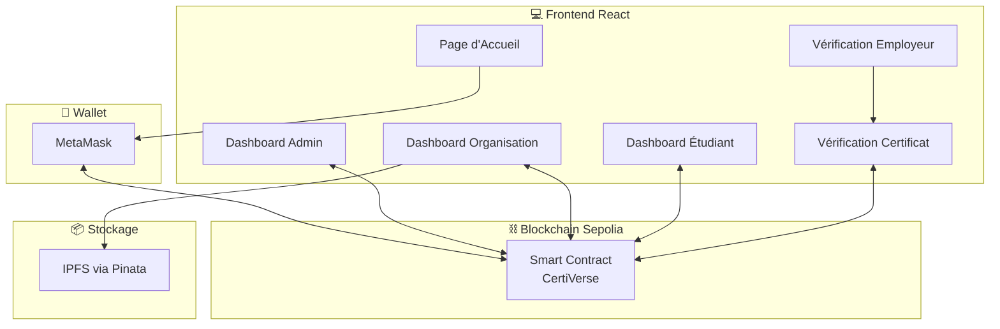
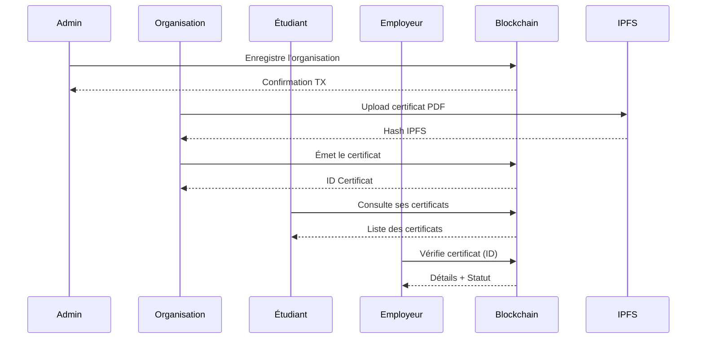

# 🎓 CertiVerse - Plateforme Décentralisée de Certification Académique

<div align="center">


[](https://react.dev/)
[](https://soliditylang.org/)
[](https://sepolia.etherscan.io/)
[](https://www.pinata.cloud/)
[](./LICENSE)

**Une solution Web3 complète pour l'émission, la gestion et la vérification de certificats académiques sur la blockchain Ethereum.**

[🌐 Application](https://certiverse-six.vercel.app) • [📄 Documentation](#documentation) • [🛠️ Installation](#installation)

</div>

---

## 📋 Table des Matières

- [Introduction](#-introduction)
- [Problématique](#-problématique)
- [Solution Proposée](#-solution-proposée)
- [Architecture](#-architecture)
- [Technologies Utilisées](#-technologies-utilisées)
- [Fonctionnalités](#-fonctionnalités)
- [Smart Contract](#-smart-contract)
- [Installation](#-installation)
- [Configuration](#-configuration)
- [Utilisation](#-utilisation)
- [Captures d'Écran](#-captures-décran)
- [Structure du Projet](#-structure-du-projet)
- [Sécurité](#-sécurité)
- [Contribution](#-contribution)
- [Auteur](#-auteur)
- [Licence](#-licence)

---

## 🌟 Introduction

**CertiVerse** est une application décentralisée (DApp) innovante qui révolutionne la gestion des certificats académiques en exploitant la puissance de la technologie blockchain. Cette plateforme permet aux institutions éducatives d'émettre des certificats numériques infalsifiables, aux étudiants de gérer leur portfolio de certifications, et aux employeurs de vérifier instantanément l'authenticité des diplômes.

### Objectifs du Projet

- ✅ **Éliminer la fraude documentaire** grâce à l'immuabilité de la blockchain
- ✅ **Simplifier le processus de vérification** pour les employeurs
- ✅ **Donner le contrôle aux étudiants** sur leurs certifications
- ✅ **Réduire les coûts administratifs** pour les institutions

---

## ❓ Problématique

Le système traditionnel de gestion des diplômes et certificats souffre de plusieurs lacunes majeures :

| Problème | Impact |
|----------|--------|
| 🔴 **Fraude documentaire** | Des milliers de faux diplômes circulent chaque année |
| 🔴 **Vérification lente et coûteuse** | Plusieurs semaines et des frais importants |
| 🔴 **Centralisation des données** | Risque de perte ou de manipulation |
| 🔴 **Manque de transparence** | Processus opaque pour toutes les parties |
| 🔴 **Accessibilité limitée** | Déplacements nécessaires pour obtenir des copies |

---

## 💡 Solution Proposée

CertiVerse répond à ces défis en proposant une architecture décentralisée basée sur :

```
┌─────────────────────────────────────────────────────────────────┐
│                    🌐 BLOCKCHAIN ETHEREUM                       │
├─────────────────────────────────────────────────────────────────┤
│  📜 Smart Contract CertiVerse                                   │
│  ├── Gestion des organisations autorisées                      │
│  ├── Émission/Révocation de certificats                        │
│  └── Traçabilité complète des opérations                       │
├─────────────────────────────────────────────────────────────────┤
│  📦 IPFS (via Pinata)                                           │
│  └── Stockage décentralisé des certificats PDF                 │
├─────────────────────────────────────────────────────────────────┤
│  💻 Frontend React                                              │
│  └── Interface utilisateur moderne et responsive               │
└─────────────────────────────────────────────────────────────────┘
```

### Avantages Clés

| Blockchain | IPFS | Interface |
|------------|------|-----------|
| ✅ Immuabilité des données | ✅ Stockage permanent | ✅ Expérience utilisateur premium |
| ✅ Transparence totale | ✅ Décentralisation | ✅ Responsive (mobile/desktop) |
| ✅ Coût minimal | ✅ Haute disponibilité | ✅ Animations fluides |

---

## 🏗️ Architecture

### Architecture Globale



### Flux Utilisateur



---

## 🛠️ Technologies Utilisées

### Frontend
| Technologie | Version | Description |
|-------------|---------|-------------|
| **React** | 19.2 | Framework UI moderne |
| **Vite** | 7.2 | Build tool ultra-rapide |
| **Framer Motion** | 12.23 | Animations fluides |
| **Lucide React** | 0.554 | Icônes modernes |
| **React Hot Toast** | 2.6 | Notifications élégantes |

### Blockchain & Web3
| Technologie | Version | Description |
|-------------|---------|-------------|
| **Solidity** | 0.8.20 | Langage smart contract |
| **Ethers.js** | 6.15 | Bibliothèque Web3 |
| **Sepolia Testnet** | - | Réseau de test Ethereum |

### Stockage & PDF
| Technologie | Version | Description |
|-------------|---------|-------------|
| **IPFS / Pinata** | - | Stockage décentralisé |
| **html2pdf.js** | 0.12 | Génération de PDF |
| **jsPDF** | 3.0 | Manipulation PDF |
| **QRCode** | 1.5 | Génération de QR codes |

### Déploiement
| Plateforme | Description |
|------------|-------------|
| **Vercel** | Hébergement frontend |
| **Sepolia** | Smart contract déployé |

---

## ✨ Fonctionnalités

### 👤 Rôles Utilisateurs

#### 1. Administrateur
- ➕ Enregistrer de nouvelles organisations
- 🚫 Révoquer les organisations non conformes
- 📊 Visualiser les statistiques globales
- 🔍 Rechercher et filtrer les organisations

#### 2. Organisation (Université, Centre de Formation, Entreprise)
- 📝 Émettre des certificats individuels ou en lot (batch)
- 📊 Analytics et statistiques détaillées
- 🔄 Révoquer des certificats si nécessaire
- 📋 Gérer la liste des certificats émis
- 🔍 Filtrer par type, statut, étudiant
- 💾 Génération automatique de PDF avec QR code

#### 3. Étudiant
- 📜 Consulter tous ses certificats
- ⬇️ Télécharger les certificats en PDF
- 🔗 Partager sur LinkedIn
- 📋 Copier le lien de vérification
- 📊 Historique des transactions blockchain

#### 4. Employeur / Vérificateur
- ✅ Vérifier l'authenticité d'un certificat par ID
- 👤 Consulter le profil complet d'un étudiant
- 🔍 Accès sans connexion wallet requise

### 🎨 Caractéristiques UI/UX
- 🌙 Design moderne avec thème sombre
- ✨ Animations fluides (Framer Motion)
- 📱 Responsive design (desktop & mobile)
- 🔔 Notifications toast élégantes
- 🎭 Gradients et effets glassmorphism

---

## 📜 Smart Contract

### Adresse du Contrat (Sepolia)
```
0xe6F2C948A7Ae5F28C8DFc7DEe81b113f6fE33904
```

> [!NOTE]
> Ce contrat est déployé sur le réseau Sepolia et est utilisé en production.

### Structures de Données

```solidity
struct Organization {
    string name;          // Nom de l'organisation
    string email;         // Email de contact
    string orgType;       // Type: "university", "training", "enterprise"
    bool isActive;        // Statut actif/révoqué
    uint256 registeredAt; // Date d'enregistrement
    uint256 totalIssued;  // Nombre de certificats émis
    uint256 totalRevoked; // Nombre révoqués
    uint256 uniqueStudents; // Étudiants uniques
}

struct Certificate {
    uint256 id;           // Identifiant unique
    address issuer;       // Adresse de l'émetteur
    string issuerName;    // Nom de l'émetteur
    address student;      // Adresse de l'étudiant
    string studentName;   // Nom de l'étudiant
    string studentEmail;  // Email de l'étudiant
    string formationName; // Nom de la formation
    string certType;      // Type: "Diplôme", "Certification", "Attestation"
    string ipfsHash;      // Hash IPFS du PDF
    uint256 issuedAt;     // Date d'émission
    bool revoked;         // Statut de révocation
}
```

### Fonctions Principales

| Fonction | Accès | Description |
|----------|-------|-------------|
| `registerOrganization()` | Admin | Enregistre une nouvelle organisation |
| `revokeOrganization()` | Admin | Révoque une organisation |
| `issueCertificate()` | Org. autorisée | Émet un certificat |
| `revokeCertificate()` | Org. émettrice | Révoque un certificat |
| `getCertificate()` | Public | Récupère les détails d'un certificat |
| `getStudentCertificates()` | Public | Liste les certificats d'un étudiant |
| `getGlobalStats()` | Public | Statistiques globales |

### Événements

```solidity
event OrganizationRegistered(address indexed org, string name);
event OrganizationRevoked(address indexed org);
event CertificateIssued(uint256 indexed certId, address indexed issuer, address indexed student, string formation);
event CertificateRevoked(uint256 indexed certId);
```

---

## 🚀 Installation

### Prérequis

- **Node.js** v18+ 
- **npm** ou **yarn**
- **MetaMask** installé sur le navigateur
- ETH de test Sepolia (via [Sepolia Faucet](https://sepoliafaucet.com/))

### Étapes d'Installation

```bash
# 1. Cloner le dépôt
git clone https://github.com/votre-username/certiverse.git
cd certiverse

# 2. Installer les dépendances
npm install

# 3. Configurer les variables d'environnement
# Créer un fichier .env à la racine (voir section Configuration)

# 4. Lancer le serveur de développement
npm run dev
```

Le projet sera accessible sur `http://localhost:5173`

### Commandes Disponibles

| Commande | Description |
|----------|-------------|
| `npm run dev` | Lancer le serveur de développement |
| `npm run build` | Compiler pour la production |
| `npm run preview` | Prévisualiser le build de production |
| `npm run lint` | Vérifier le code avec ESLint |

---

## ⚙️ Configuration

### Variables d'Environnement

Créez un fichier `.env` à la racine du projet en copiant `.env.example` :

```bash
cp .env.example .env
```

Puis remplissez les valeurs :

```env
# Pinata IPFS Configuration
VITE_PINATA_JWT=your_pinata_jwt_token_here
VITE_PINATA_GATEWAY=ipfs.io
VITE_PINATA_API_URL=https://api.pinata.cloud/pinning/pinFileToIPFS

# Blockchain Configuration
VITE_CONTRACT_ADDRESS=0xe6F2C948A7Ae5F28C8DFc7DEe81b113f6fE33904
VITE_RPC_URL=https://ethereum-sepolia-rpc.publicnode.com
VITE_ETHERSCAN_BASE_URL=https://sepolia.etherscan.io

# Application Configuration
VITE_APP_BASE_URL=http://localhost:5173
VITE_IPFS_PUBLIC_GATEWAY=ipfs.io
VITE_QR_API_URL=https://api.qrserver.com/v1/create-qr-code
```

> [!IMPORTANT]
> **Pour le déploiement en production (Vercel)**
> - Configurez toutes les variables d'environnement dans les paramètres du projet
> - Changez `VITE_APP_BASE_URL` vers votre URL de production
> - Ne commitez JAMAIS le fichier `.env` (déjà dans `.gitignore`)

### Obtenir votre Token Pinata JWT

1. Créez un compte sur [Pinata](https://www.pinata.cloud/)
2. Accédez à "API Keys" dans le dashboard
3. Créez une nouvelle clé avec les permissions d'upload
4. Copiez le JWT token dans votre `.env`

### Configuration MetaMask

1. Ouvrir MetaMask
2. Ajouter le réseau Sepolia :
   - **Nom du réseau** : Sepolia Test Network
   - **URL RPC** : `https://ethereum-sepolia-rpc.publicnode.com`
   - **ID de chaîne** : 11155111
   - **Symbole** : ETH
   - **Explorateur** : `https://sepolia.etherscan.io`
3. Obtenir des ETH de test via [Sepolia Faucet](https://sepoliafaucet.com/)

---

## 📖 Utilisation

### Pour l'Administrateur

1. Connecter le wallet administrateur
2. Accéder au tableau de bord Admin
3. Cliquer sur "Ajouter une organisation"
4. Remplir le formulaire (adresse wallet, nom, email, type)
5. Confirmer la transaction MetaMask

### Pour une Organisation

1. Connecter le wallet de l'organisation
2. Accéder au tableau de bord Organisation
3. **Émission individuelle** :
   - Remplir les informations de l'étudiant
   - Générer le certificat PDF
   - Confirmer la transaction
4. **Émission en lot** :
   - Cliquer sur "Émission en Lot"
   - Ajouter plusieurs étudiants
   - Émettre tous les certificats

### Pour un Étudiant

1. Connecter le wallet
2. Visualiser automatiquement tous les certificats reçus
3. Télécharger, partager ou vérifier chaque certificat

### Pour un Employeur

1. Accéder à `/employer` (sans connexion requise)
2. Choisir "Vérifier un Certificat" ou "Consulter un Profil"
3. Entrer l'ID du certificat ou l'adresse de l'étudiant
4. Visualiser les détails et le statut d'authenticité

---

## 📸 Captures d'Écran

### Page d'Accueil
Interface moderne avec connexion MetaMask et accès employeur.

### Dashboard Admin
- Statistiques globales
- Liste des organisations
- Formulaire d'ajout

### Dashboard Organisation
- Analytics détaillées
- Émission individuelle et en lot
- Gestion des certificats

### Dashboard Étudiant
- Portfolio de certificats
- Téléchargement PDF
- Historique des transactions

### Vérification Employeur
- Interface publique
- Vérification par ID
- Consultation de profil

---

## 📁 Structure du Projet

```
certiverse/
├── public/               # Fichiers statiques
├── src/
│   ├── assets/           # Images et ressources
│   ├── components/       # Composants React réutilisables
│   │   ├── BatchCertificateIssuer.jsx    # Émission en lot
│   │   ├── LinkedInShareButton.jsx       # Partage LinkedIn
│   │   └── OrganizationAnalytics.jsx     # Graphiques analytics
│   ├── context/
│   │   └── Web3Context.jsx    # Contexte React pour Web3/MetaMask
│   ├── pages/
│   │   ├── HomePage.jsx              # Page d'accueil
│   │   ├── AdminDashboard.jsx        # Dashboard administrateur
│   │   ├── OrganizationDashboard.jsx # Dashboard organisation
│   │   ├── StudentDashboard.jsx      # Dashboard étudiant
│   │   ├── EmployerVerification.jsx  # Portail employeur
│   │   ├── CertificateVerification.jsx # Vérification certificat
│   │   └── StudentProfileViewer.jsx  # Profil étudiant public
│   ├── utils/
│   │   ├── contract.js           # Configuration ethers.js + ABI
│   │   ├── certificateTemplate.js # Template HTML des certificats
│   │   └── pdfGenerator.js       # Génération PDF
│   ├── App.jsx           # Composant principal + routing
│   ├── App.css           # Styles spécifiques App
│   ├── index.css         # Styles globaux + design system
│   └── main.jsx          # Point d'entrée React
├── Contract.txt          # Code source Solidity du smart contract
├── index.html            # Template HTML
├── package.json          # Dépendances npm
├── vite.config.js        # Configuration Vite
├── vercel.json           # Configuration déploiement Vercel
├── .env                  # Variables d'environnement (non commitées)
├── .env.example          # Template de configuration
├── .gitignore            # Fichiers ignorés par Git
└── README.md             # Ce fichier
```

---

## 🔒 Sécurité

### Mesures Implémentées

- 🔐 **Rôles et permissions** : Seul l'admin peut gérer les organisations
- 🔐 **Organisations autorisées** : Seules les organisations actives peuvent émettre
- 🔐 **Révocation traçable** : Historique permanent des révocations
- 🔐 **Vérification on-chain** : Authenticité vérifiable par n'importe qui
- 🔐 **Stockage IPFS** : Certificats immuables et disponibles
- 🔐 **QR Code intégré** : Vérification rapide et sécurisée

### Bonnes Pratiques

- Ne jamais partager sa clé privée
- Vérifier l'adresse du contrat avant interaction
- Utiliser un hardware wallet pour les comptes administrateurs

---

## 🤝 Contribution

Les contributions sont les bienvenues ! Voici comment participer :

```bash
# 1. Forker le projet

# 2. Créer une branche pour votre fonctionnalité
git checkout -b feature/NouvelleFeature

# 3. Commiter vos changements
git commit -m "Ajout de NouvelleFeature"

# 4. Pousser sur la branche
git push origin feature/NouvelleFeature

# 5. Ouvrir une Pull Request
```

### Guidelines

- Suivre les conventions de code existantes
- Documenter les nouvelles fonctionnalités
- Tester avant de soumettre
- Écrire des messages de commit clairs

---

## 👨‍💻 Auteur

**Projet développé dans le cadre du module Blockchain**

---

## 📄 Licence

Ce projet est sous licence MIT. Voir le fichier [LICENSE](./LICENSE) pour plus de détails.

---

<div align="center">

**⭐ Si ce projet vous a été utile, n'hésitez pas à lui donner une étoile !**

Made with ❤️ and ⛓️ Blockchain Technology

</div>