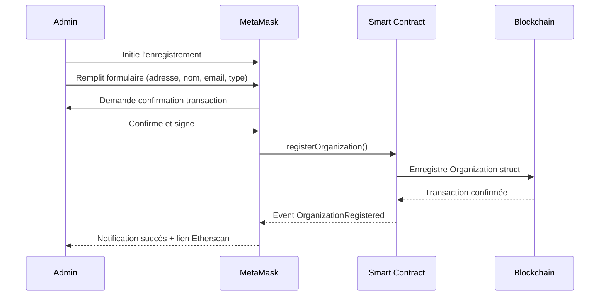
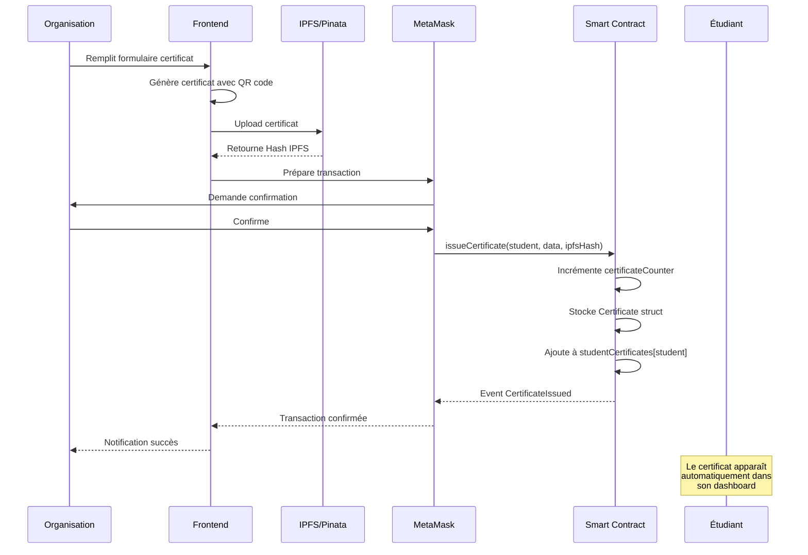
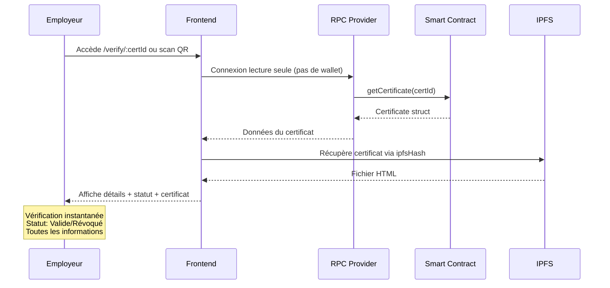

# 🎓 CertiVerse - Plateforme Décentralisée de Certification Académique et Professionnelle

<div align="center">


[](https://react.dev/)
[](https://soliditylang.org/)
[](https://sepolia.etherscan.io/)
[](https://www.pinata.cloud/)
[](./LICENSE)

**Une solution Web3 complète pour l'émission, la gestion et la vérification de certificats académiques / professionnels sur la blockchain Ethereum.**

[🌐 Application](https://certiverse-six.vercel.app) • [🛠️ Installation](#-installation)

</div>

---

## 📋 Table des Matières

- [Introduction](#-introduction)
- [Problématique](#-problématique)
- [Solution Proposée](#-solution-proposée)
- [Flux Principaux du Système](#-flux-principaux-du-système)
- [Technologies Utilisées](#%EF%B8%8F-technologies-utilisées)
- [Fonctionnalités](#-fonctionnalités)
- [Smart Contract](#-smart-contract---fonctions-principales)
- [Guide de Déploiement (Remix)](#-guide-de-déploiement-remix)
- [Installation](#-installation)
- [Configuration](#%EF%B8%8F-configuration)
- [Utilisation](#-utilisation)
- [Démonstration](#-démonstration)
- [Structure du Projet](#-structure-du-projet)
- [Sécurité](#-sécurité)
- [Perspectives & Améliorations Futures](#-perspectives--améliorations-futures)
- [Auteur](#-auteur)
  
---

## 🌟 Introduction

**CertiVerse** est une application décentralisée (DApp) innovante qui révolutionne la gestion des certificats académiques et professionnelles en exploitant la puissance de la technologie blockchain. Cette plateforme permet aux organisations (Institutions éducatives, Université, Centre de Formation, Entreprise) d'émettre des certificats numériques infalsifiables, aux étudiants de gérer leur portfolio de certifications, et aux employeurs de vérifier instantanément l'authenticité des diplômes.

### Objectifs du Projet

- ✅ **Éliminer la fraude documentaire** grâce à l'immuabilité de la blockchain
- ✅ **Simplifier le processus de vérification** pour les employeurs
- ✅ **Donner le contrôle aux étudiants** sur leurs certifications
- ✅ **Réduire les coûts administratifs** pour les institutions

---

## ❓ Problématique

Le système traditionnel de gestion des diplômes et certificats souffre de plusieurs lacunes majeures :

| Problème | Impact |
|----------|--------|
| 🔴 **Fraude documentaire** | Des milliers de faux diplômes circulent chaque année |
| 🔴 **Vérification lente et coûteuse** | Plusieurs semaines et des frais importants |
| 🔴 **Centralisation des données** | Risque de perte ou de manipulation |
| 🔴 **Manque de transparence** | Processus opaque pour toutes les parties |
| 🔴 **Accessibilité limitée** | Déplacements nécessaires pour obtenir des copies |

---

## 💡 Solution Proposée

CertiVerse répond à ces défis en proposant une architecture décentralisée basée sur :

```
┌─────────────────────────────────────────────────────────────────
│                    🌐 BLOCKCHAIN ETHEREUM                       
├─────────────────────────────────────────────────────────────────
│  📜 Smart Contract CertiVerse                                   
│  ├── Gestion des organisations autorisées                     
│  ├── Émission/Révocation de certificats                        
│  ├── Traçabilité complète des opérations
│  ├── Déployé sur Ethereum Sepolia (testnet réel)
│  ├── Transactions visibles sur Etherscan
│  └── Falsification impossible                 
├─────────────────────────────────────────────────────────────────
│  📦 IPFS (via Pinata)                                           
│  ├── Stockage décentralisé et permanent des certificats
│  └── Vérification publique instantanée
│        ~ Accessible sans compte (/verify/ID)         
├─────────────────────────────────────────────────────────────────
│  💻 Frontend React
│  ├── Changement de compte MetaMask détecté instantanément                     
│  ├── Partage automatique des certifications sur LinkedIn
│  ├── Export des certifications en PDF                                            
│  └── Interface utilisateur moderne et responsive               
└─────────────────────────────────────────────────────────────────
```

### Avantages Clés

| Blockchain | IPFS | Interface |
|------------|------|-----------|
| ✅ Immuabilité des données | ✅ Stockage permanent | ✅ Expérience utilisateur premium |
| ✅ Transparence totale | ✅ Décentralisation | ✅ Responsive (mobile/desktop) |
| ✅ Coût minimal | ✅ Haute disponibilité | ✅ Animations fluides |

---

## 🔄 Flux Principaux du Système

### Flux 1 : Enregistrement d'une Organisation



### Flux 2 : Émission d'un Certificat



### Flux 3 : Vérification par un Employeur


---

## 🛠️ Technologies Utilisées

### Frontend
| Technologie | Version | Description |
|-------------|---------|-------------|
| **React** | 19.2 | Framework UI moderne |
| **Vite** | 7.2 | Build tool ultra-rapide |
| **Framer Motion** | 12.23 | Animations fluides |
| **Lucide React** | 0.554 | Icônes modernes |
| **React Hot Toast** | 2.6 | Notifications élégantes |

### Blockchain & Web3
| Technologie | Version | Description |
|-------------|---------|-------------|
| **Solidity** | 0.8.20 | Langage smart contract |
| **Ethers.js** | 6.15 | Bibliothèque Web3 |
| **Sepolia Testnet** | - | Réseau de test Ethereum |

### Stockage & PDF
| Technologie | Version | Description |
|-------------|---------|-------------|
| **IPFS / Pinata** | - | Stockage décentralisé |
| **html2pdf.js** | 0.12 | Génération de PDF |
| **jsPDF** | 3.0 | Manipulation PDF |
| **QRCode** | 1.5 | Génération de QR codes |

### Déploiement
| Plateforme | Description |
|------------|-------------|
| **Vercel** | Hébergement frontend |
| **Sepolia** | Smart contract déployé |

---

## ✨ Fonctionnalités

### 👤 Rôles Utilisateurs

#### 1. Administrateur
**Rôle** : Garant de l'écosystème, gère les droits d'émission
- ➕ Enregistrer de nouvelles organisations
- 🚫 Révoquer les organisations non conformes
- 📊 Visualiser les statistiques globales
- 🔍 Rechercher et filtrer les organisations

**Actions** :
- `registerOrganization()` - Ajouter une institution
- `revokeOrganization()` - Retirer les droits d'une institution
- Consultation du dashboard avec métriques globales

#### 2. Organisation (Université, Centre de Formation, Entreprise)
**Rôle** : Émetteur de certificats pour ses étudiants/collaborateurs
- 📝 Émettre des certificats individuels ou en lot (batch)
- 📊 Analytics et statistiques détaillées
- 🔄 Révoquer des certificats si nécessaire
- 📋 Gérer la liste des certificats émis
- 🔍 Filtrer par type, statut, étudiant
- 💾 Génération automatique de certificat avec QR code

**Actions** :
- `issueCertificate()` - Emission individuelle
- Batch issuance - Emission en lot (frontend)
- `revokeCertificate()` - Révocation
- Upload certificat sur IPFS via Pinata
- Filtrage et recherche dans ses certificats

#### 3. Étudiant
**Rôle** : Bénéficiaire et propriétaire de ses certificats
- 📜 Consulter tous ses certificats
- ⬇️ Télécharger les certificats en PDF
- 🔗 Partager sur LinkedIn
- 📋 Copier le lien de vérification
- 📊 Historique des transactions blockchain

**Actions** :
- Connexion via wallet MetaMask
- Visualisation automatique de tous ses certificats
- Téléchargement PDF
- Copie du lien de vérification
- Partage sur LinkedIn

#### 4. Employeur / Vérificateur
**Rôle** : Tiers de confiance vérifiant l'authenticité des diplômes
- ✅ Vérifier l'authenticité d'un certificat par ID
- 👤 Consulter le profil complet d'un étudiant
- 🔍 Accès sans connexion wallet requise

**Actions** :
- Vérification par ID de certificat
- Consultation du profil étudiant par adresse wallet
- Accès public à `/employer` et `/verify/:id`
- Scan de QR code pour vérification instantanée

### 🎨 Caractéristiques UI/UX
- 🌙 Design moderne
- ✨ Animations fluides (Framer Motion)
- 📱 Responsive design (desktop & mobile)
- 🔔 Notifications toast élégantes
- 🎭 Gradients et effets glassmorphism

---

## 📜 Smart Contract - Fonctions Principales

### Adresse du Contrat (Sepolia)
```
0xe6F2C948A7Ae5F28C8DFc7DEe81b113f6fE33904
```

> [!NOTE]
> Ce contrat est déployé sur le réseau Sepolia et est utilisé en production.

### Variables d'État

```solidity
// Adresse de l'administrateur (définie au déploiement, immutable)
address public immutable admin;

// Compteur global des certificats émis
uint256 public certificateCounter;

// Mapping : adresse organisation => données organisation
mapping(address => Organization) public organizations;

// Liste des adresses d'organisations (pour itération)
address[] public organizationList;

// Mapping : ID certificat => données certificat
mapping(uint256 => Certificate) public certificates;

// Mapping : adresse étudiant => array d'IDs de certificats
mapping(address => uint256[]) public studentCertificates;

// Mapping privé pour tracker les étudiants uniques par organisation
mapping(address => mapping(address => bool)) private hasReceivedFromOrg;
```

### Structures de Données

#### Organization
```solidity
struct Organization {
    string name;             // Nom de l'organisation
    string email;            // Email de contact
    string orgType;          // "university" | "training" | "enterprise"
    bool isActive;           // true = peut émettre, false = révoquée
    uint256 registeredAt;    // Timestamp d'enregistrement
    uint256 totalIssued;     // Nombre total de certificats émis
    uint256 totalRevoked;    // Nombre de certificats révoqués
    uint256 uniqueStudents;  // Nombre d'étudiants uniques
}
```

#### Certificate
```solidity
struct Certificate {
    uint256 id;              // Identifiant unique (auto-incrémenté)
    address issuer;          // Adresse wallet de l'organisation émettrice
    string issuerName;       // Nom de l'organisation (copié au moment de l'émission)
    address student;         // Adresse wallet de l'étudiant
    string studentName;      // Nom complet de l'étudiant
    string studentEmail;     // Email de l'étudiant
    string formationName;    // Nom de la formation/diplôme
    string certType;         // "Diplôme" | "Certification" | "Attestation"
    string ipfsHash;         // Hash IPFS du certificat (QmXXXX...)
    uint256 issuedAt;        // Timestamp d'émission
    bool revoked;            // Statut de révocation
}
```

### Fonctions Administrateur

#### registerOrganization
```solidity
function registerOrganization(
    address orgAddress,
    string memory name,
    string memory email,
    string memory orgType,
    uint256 registeredAt
) external onlyAdmin
```
**Description** : Enregistre une nouvelle organisation autorisée à émettre des certificats.

**Vérifications** :
- `orgAddress != address(0)` - Adresse valide
- `bytes(name).length > 0` - Nom non vide
- `!organizations[orgAddress].isActive` - Pas déjà enregistrée

**Actions** :
- Crée une nouvelle `Organization` struct
- Ajoute à `organizationList`
- Émet l'événement `OrganizationRegistered`

#### revokeOrganization
```solidity
function revokeOrganization(address orgAddress) external onlyAdmin
```
**Description** : Révoque une organisation (elle ne peut plus émettre de nouveaux certificats).

**Vérifications** :
- `organizations[orgAddress].isActive` - Org existe et est active

**Actions** :
- Passe `isActive` à `false`
- Émet l'événement `OrganizationRevoked`

### Fonctions Organisation

#### issueCertificate
```solidity
function issueCertificate(
    address student,
    string memory studentName,
    string memory studentEmail,
    string memory formationName,
    string memory certType,
    string memory ipfsHash,
    uint256 issuedAt
) external onlyAuthorizedOrg
```
**Description** : Émet un nouveau certificat pour un étudiant.

**Vérifications** :
- `onlyAuthorizedOrg` - Organisation active
- `student != address(0)` - Adresse étudiant valide
- `bytes(studentName).length > 0` - Nom non vide
- `bytes(ipfsHash).length > 0` - Hash IPFS fourni

**Actions** :
1. Incrémente `certificateCounter`
2. Met à jour les statistiques de l'organisation :
   - `totalIssued++`
   - Si nouvel étudiant : `uniqueStudents++`
3. Crée le `Certificate` struct
4. Ajoute l'ID à `studentCertificates[student]`
5. Émet l'événement `CertificateIssued`

#### revokeCertificate
```solidity
function revokeCertificate(uint256 certId) external onlyAuthorizedOrg
```
**Description** : Révoque un certificat précédemment émis.

**Vérifications** :
- `cert.issuer == msg.sender` - Seul l'émetteur peut révoquer
- `!cert.revoked` - Pas déjà révoqué

**Actions** :
- Passe `revoked` à `true`
- Incrémente `org.totalRevoked`
- Émet l'événement `CertificateRevoked`

### Fonctions de Lecture (View)

#### getCertificate
```solidity
function getCertificate(uint256 certId) external view returns (Certificate memory)
```
Retourne les détails complets d'un certificat par son ID.

#### getStudentCertificates
```solidity
function getStudentCertificates(address student) external view returns (Certificate[] memory)
```
Retourne tous les certificats d'un étudiant.

#### getOrganizationCertificates
```solidity
function getOrganizationCertificates(address org) external view returns (Certificate[] memory)
```
Retourne tous les certificats émis par une organisation.

#### getAllOrganizations
```solidity
function getAllOrganizations() external view returns (...)
```
Retourne la liste complète de toutes les organisations avec leurs statistiques.

#### getGlobalStats
```solidity
function getGlobalStats() external view returns (
    uint256 totalOrgs,
    uint256 activeOrgs,
    uint256 totalCerts,
    uint256 revokedCerts
)
```
Retourne les statistiques globales de la plateforme.

## 🔔 Événements (Events)

```solidity
event OrganizationRegistered(address indexed org, string name);
event OrganizationRevoked(address indexed org);
event CertificateIssued(uint256 indexed certId, address indexed issuer, 
                        address indexed student, string formation);
event CertificateRevoked(uint256 indexed certId);
```

**Utilité** :
- Logging on-chain pour traçabilité complète
- Indexation par Etherscan et explorateurs blockchain
- Écoute d'événements côté frontend (notifications en temps réel)
- Audit trail immuable

---

## 🦊 Guide de Déploiement (Remix)

Si vous souhaitez déployer votre propre version du smart contract :

1.  **Copier le Code** : Ouvrez `Contract.sol` et copiez tout le contenu.
2.  **Ouvrir Remix** : Allez sur [Remix IDE](https://remix.ethereum.org/).
3.  **Créer le Fichier** : Créez un nouveau fichier `CertiVerse.sol` et collez-y le code.
4.  **Compiler** : 
    - Allez dans l'onglet "Solidity Compiler".
    - Sélectionnez la version `0.8.20`.
    - Cliquez sur "Compile CertiVerse.sol".
5.  **Déployer** :
    - Allez dans l'onglet "Deploy & Run Transactions".
    - Sélectionnez "Injected Provider - MetaMask" comme environnement.
    - Connectez votre MetaMask (réseau Sepolia).
    - Cliquez sur "Deploy" et confirmez la transaction.
6.  **Récupérer les Infos** :
    - Une fois déployé, copiez l'adresse du contrat (section "Deployed Contracts").
    - Copiez l'ABI (onglet "Solidity Compiler" > bouton "ABI" en bas).
7.  **Mettre à jour la Configuration** :
    - Remplacez l'adresse dans `.env` (`VITE_CONTRACT_ADDRESS`).
    - Remplacez l'ABI dans `src/utils/ContractABI.json`.

## 🚀 Installation

### Prérequis

- **Node.js** v18+ 
- **npm** ou **yarn**
- **MetaMask** installé sur le navigateur
- ETH de test Sepolia (via [Google Cloud Web3 Faucet](https://cloud.google.com/application/web3/faucet/ethereum/sepolia))

### Étapes d'Installation

```bash
# 1. Cloner le dépôt
git clone https://github.com/votre-username/certiverse.git
cd certiverse

# 2. Installer les dépendances
npm install

# 3. Configurer les variables d'environnement
# Créer un fichier .env à la racine (voir section Configuration)

# 4. Lancer le serveur de développement
npm run dev
```

Le projet sera accessible sur `http://localhost:5173`

---

## ⚙️ Configuration

### Variables d'Environnement

Créez un fichier `.env` à la racine du projet en copiant `.env.example` :

```bash
cp .env.example .env
```

Puis remplissez les valeurs :

```env
# Pinata IPFS Configuration
VITE_PINATA_JWT=your_pinata_jwt_token_here
VITE_PINATA_GATEWAY=ipfs.io
VITE_PINATA_API_URL=https://api.pinata.cloud/pinning/pinFileToIPFS

# Blockchain Configuration
# Option A : Utiliser le contrat de démo (déjà déployé)
# Option B : Utiliser votre propre contrat (remplacez par votre adresse)
VITE_CONTRACT_ADDRESS=0xe6F2C948A7Ae5F28C8DFc7DEe81b113f6fE33904
VITE_RPC_URL=https://ethereum-sepolia-rpc.publicnode.com
VITE_ETHERSCAN_BASE_URL=https://sepolia.etherscan.io

# Application Configuration
VITE_APP_BASE_URL=http://localhost:5173
VITE_IPFS_PUBLIC_GATEWAY=ipfs.io
VITE_QR_API_URL=https://api.qrserver.com/v1/create-qr-code
```

### Configuration du Smart Contract (ABI)

Pour que le frontend puisse interagir avec votre contrat, vous devez mettre à jour l'ABI :

1.  Copiez l'ABI depuis Remix (voir section Déploiement).
2.  Ouvrez `src/utils/ContractABI.json`.
3.  Remplacez tout le contenu par votre nouvel ABI (gardez le format JSON `[...]`).

### Obtenir votre Token Pinata JWT

1. Créez un compte sur [Pinata](https://www.pinata.cloud/)
2. Accédez à "API Keys" dans le dashboard
3. Créez une nouvelle clé avec les permissions d'upload
4. Copiez le JWT token dans votre `.env`

### Configuration MetaMask

1. **Ouvrir MetaMask**.
2. **Activer les réseaux de test** :
   - Cliquez sur le sélecteur de réseau (en haut à gauche).
   - Activez l'option **"Afficher les réseaux de test"** (Show test networks).
   - Sélectionnez **Sepolia** dans la liste.
3. Obtenir des ETH de test via [Google Cloud Web3 Faucet](https://cloud.google.com/application/web3/faucet/ethereum/sepolia)

---

## 📖 Utilisation

### ⚠️ Note Importante : Droits d'Accès

> [!IMPORTANT]
> **Le contrat de démo** (`0xe6F...`) appartient à l'administrateur initial (celui qui l'a déployé).
> 
> Si vous utilisez ce contrat :
> - ❌ Vous **NE POURREZ PAS** vous connecter en tant qu'**Admin** (vous n'avez pas la clé privée).
> - ❌ Vous **NE POURREZ PAS** ajouter d'organisation.
> - ❌ Vous **NE POURREZ PAS** émettre de certificats.
>
> 👉 **Pour tester ces fonctionnalités (Admin, Organisation), vous DEVEZ déployer votre propre contrat** (voir section *Guide de Déploiement*).

### Pour l'Administrateur (Sur votre propre contrat)

1. Connecter le wallet administrateur
2. Accéder au tableau de bord Admin
3. Cliquer sur "Ajouter une organisation"
4. Remplir le formulaire (adresse wallet, nom, email, type)
5. Confirmer la transaction MetaMask

### Pour une Organisation

1. Connecter le wallet de l'organisation
2. Accéder au tableau de bord Organisation
3. **Émission individuelle** :
   - Remplir les informations de l'étudiant
   - Générer le certificat
   - Confirmer la transaction
4. **Émission en lot** :
   - Cliquer sur "Émission en Lot"
   - Ajouter plusieurs étudiants
   - Émettre tous les certificats

### Pour un Étudiant

1. Connecter le wallet
2. Visualiser automatiquement tous les certificats reçus
3. Télécharger, partager ou vérifier chaque certificat

### Pour un Employeur

1. Accéder à `/employer` (sans connexion requise)
2. Choisir "Vérifier un Certificat" ou "Consulter un Profil"
3. Entrer l'ID du certificat ou l'adresse de l'étudiant
4. Visualiser les détails et le statut d'authenticité

---

## 🎥 Démonstration

[](https://www.youtube.com/watch?v=VIDEO_ID)

> *Cliquez sur l'image pour voir la vidéo de démonstration du parcours complet.*

---

## 📁 Structure du Projet

```
certiverse/
├── public/               # Fichiers statiques
├── src/
│   ├── assets/           # Images et ressources
│   ├── components/       # Composants React réutilisables
│   │   ├── BatchCertificateIssuer.jsx    # Émission en lot
│   │   ├── LinkedInShareButton.jsx       # Partage LinkedIn
│   │   └── OrganizationAnalytics.jsx     # Graphiques analytics
│   ├── context/
│   │   └── Web3Context.jsx    # Contexte React pour Web3/MetaMask
│   ├── pages/
│   │   ├── HomePage.jsx              # Page d'accueil
│   │   ├── AdminDashboard.jsx        # Dashboard administrateur
│   │   ├── OrganizationDashboard.jsx # Dashboard organisation
│   │   ├── StudentDashboard.jsx      # Dashboard étudiant
│   │   ├── EmployerVerification.jsx  # Portail employeur
│   │   ├── CertificateVerification.jsx # Vérification certificat
│   │   └── StudentProfileViewer.jsx  # Profil étudiant public
│   ├── utils/
│   │   ├── contract.js           # Configuration ethers.js + ABI
│   │   ├── certificateTemplate.js # Template HTML des certificats
│   │   └── pdfGenerator.js       # Génération PDF
│   ├── App.jsx           # Composant principal + routing
│   ├── App.css           # Styles spécifiques App
│   ├── index.css         # Styles globaux + design system
│   └── main.jsx          # Point d'entrée React
├── Contract.sol          # Code source Solidity du smart contract
├── index.html            # Template HTML
├── package.json          # Dépendances npm
├── vite.config.js        # Configuration Vite
├── vercel.json           # Configuration déploiement Vercel 
├── .env                  # Variables d'environnement (non commitées)
├── .env.example          # Template de configuration
├── .gitignore            # Fichiers ignorés par Git
└── README.md             # Ce fichier
```

---

## 🔒 Sécurité

### Mesures Implémentées

- 🔐 **Rôles et permissions** : Seul l'admin peut gérer les organisations
- 🔐 **Organisations autorisées** : Seules les organisations actives peuvent émettre
- 🔐 **Révocation traçable** : Historique permanent des révocations
- 🔐 **Vérification on-chain** : Authenticité vérifiable par n'importe qui
- 🔐 **Stockage IPFS** : Certificats immuables et disponibles
- 🔐 **QR Code intégré** : Vérification rapide et sécurisée

---

## 🚀 Perspectives & Améliorations Futures

Ce projet pose les fondations d'un écosystème éducatif décentralisé. Voici les pistes d'évolution envisagées :

- **Soulbound Tokens (SBT)** : Migration vers le standard ERC-4671 pour rendre les diplômes strictement intransférables.
- **Gouvernance DAO** : Implémentation d'une DAO pour permettre aux institutions de voter sur les mises à jour du protocole.
- **Verifiable Credentials (W3C)** : Compatibilité avec les standards d'identité décentralisée (DID) pour une portabilité accrue.
- **Support Multi-Chain** : Déploiement sur d'autres layer-2 (Polygon, Optimism) pour réduire les coûts de gaz.

---

## 👨‍💻 Auteur

**Projet réalisé dans le cadre du module Blockchain**

### 👥 Équipe de Développement

- **Fida Ghourabi**
- **Mohamed Yassine Mathlouthi**
- **Mohamed Said Chbinou**

### 👨‍🏫 Supervision

Projet supervisé par **Mme Nourhene Ellouze**

---

<div align="center">

Made with ❤️ and ⛓️ Blockchain Technology

</div>
